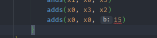
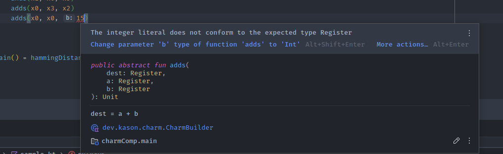

# Charm code generator
Are you tired of having to write AArch64 "Charm" assembly by hand?

Does your code constantly fail to pass `make verify`? Well, this ChARM code
generator will fix all your problems!

Instead of writing assembly directly to a file like a pleb, you can now enjoy the power
of static type analysis through your IDE. Furthermore, you can use loops and all the other
features of a regular programming language to help write your code.

### Examples:

This is all it takes to complete the `hamming_distance` function:
```kt
outputBuilder {
    eor(x0, x1, x0)
    val values = listOf<ULong>(
        0x5555555555555555u, 0x3333333333333333u, 0x0f0f0f0f0f0f0f0fu,
        0x00ff00ff00ff00ffu, 0x0000ffff0000ffffu, 0x00000000ffffffffu
    )
    for ((index, value) in values.withIndex()) {
        moveConstTo(x3, value)
        ands(x1, x0, x3)
        lsr(x2, x0, (1 shl index).toUShort())
        ands(x2, x2, x3)
        adds(x0, x1, x2)
    }
}
```

We can't use loops in our assembly code, so why not use a loop to generate your assembly code?

Here's the output of executing the code above (check `sample.kt`)
```
eor x0, x1, x0
movk x3, #0x5555, lsl 0
movk x3, #0x5555, lsl 16
movk x3, #0x5555, lsl 32
movk x3, #0x5555, lsl 48
ands x1, x0, x3
lsr x2, x0, #0x0001
ands x2, x2, x3
adds x0, x1, x2
movk x3, #0x3333, lsl 0
movk x3, #0x3333, lsl 16
movk x3, #0x3333, lsl 32
movk x3, #0x3333, lsl 48
ands x1, x0, x3
lsr x2, x0, #0x0002
ands x2, x2, x3
adds x0, x1, x2
movk x3, #0x0f0f, lsl 0
movk x3, #0x0f0f, lsl 16
movk x3, #0x0f0f, lsl 32
movk x3, #0x0f0f, lsl 48
ands x1, x0, x3
lsr x2, x0, #0x0004
ands x2, x2, x3
adds x0, x1, x2
movk x3, #0x00ff, lsl 0
movk x3, #0x00ff, lsl 16
movk x3, #0x00ff, lsl 32
movk x3, #0x00ff, lsl 48
ands x1, x0, x3
lsr x2, x0, #0x0008
ands x2, x2, x3
adds x0, x1, x2
movk x3, #0xffff, lsl 0
movk x3, #0x0000, lsl 16
movk x3, #0xffff, lsl 32
movk x3, #0x0000, lsl 48
ands x1, x0, x3
lsr x2, x0, #0x0010
ands x2, x2, x3
adds x0, x1, x2
movk x3, #0xffff, lsl 0
movk x3, #0xffff, lsl 16
movk x3, #0x0000, lsl 32
movk x3, #0x0000, lsl 48
ands x1, x0, x3
lsr x2, x0, #0x0020
ands x2, x2, x3
adds x0, x1, x2
```

But ok, that _was_ the easiest task ever. Let's see how it fares against the `transpose` function:

```kt

fun transpose() = outputBuilder {
    repeat(3) {
        outerPS()
    }
}

val data = listOf(
    arrayOf<ULong>(0x00000000ffff0000u, 0xffff00000000ffffu, 16u),
    arrayOf<ULong>(0x0000ff000000ff00u, 0xff0000ffff0000ffu, 8u),
    arrayOf<ULong>(0x00f000f000f000f0u, 0xf00ff00ff00ff00fu, 4u),
    arrayOf<ULong>(0x0c0c0c0c0c0c0c0cu, 0xc3c3c3c3c3c3c3c3u, 2u),
    arrayOf<ULong>(0x2222222222222222u, 0x9999999999999999u, 1u),
)

fun CharmBuilder.outerPS() {
    for ((m1, m2, rawS) in data) {
        val s = rawS.toUShort()
        moveConstTo(x4, m1)
        moveConstTo(x5, m2)
        ands(x3, x0, x4)
        lsl(x3, x3, s)
        lsr(x2, x0, s)
        ands(x2, x2, x4)
        ands(x1, x0, x5)
        adds(x0, x3, x2)
        adds(x0, x0, x1)
    }
}
```

A little more complex, but it's still relatively easy to understand (except for the pure
assembly part). But the benefit of this is you'll never type a wrong instruction again!

If you accidentally put an immediate when the command is supposed to take a register, for example,
the static type checker will immediately warn you:



_on hover:_


## Woa, that's so cool, I wanna download it immediately!!

Setting this up might take some work depending on your current Kotlin/Java setup.

The easiest way is probably using IntelliJ. If you don't have that, install it (https://www.jetbrains.com/idea/download/). Afterward,
simply do `New > Project from Version Control` and clone this repository.

Gradle should automatically read the build files and download the necessary files (with `gradlew-wrapper` updated
to the newest version.)

To write code to execute, simply do 
```kt
outputBuilder {
    // charm code here!
}
```

within a Kotlin file within the project scope (which is `src/main/kotlin`)

Either put that in a function called by `main()` or directly in your main. Running the code is as simple as
selecting the run button next to your main function!

#### Note:
Please RUN THIS LOCALLY!! Please don't ssh into an AWS machine and run a whole IntelliJ instance
with this project. All this does is generate code (so far), so you can run it on your computer, ssh
your VSCode or whatever onto the lab machine, and copy the output from the IntelliJ terminal into your
editor. 